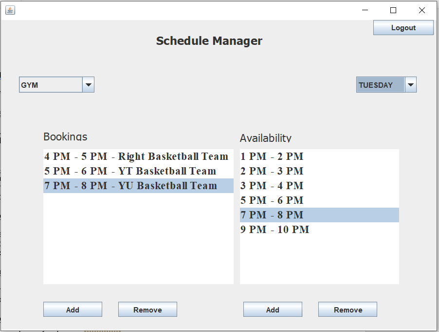
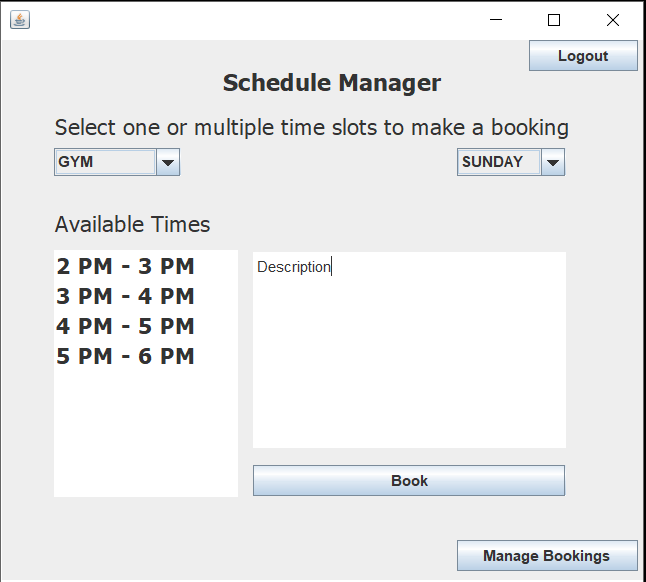

# Space Assigner Project

CS3716 Software Methodology

## Anuj Wagle (201511763, aw7464@mun.ca)
 ,
Prasanga Dhakal (201459542, pd4537@mun.ca)
 ,
Wenrui Zhen (201409489, wz8031@mun.ca)

## Project Outline

This project will follow feature-driven development.

Here are the features our final product would have (ordered by priority,
highest to lowest):

1. The principle will be able to start with a blank schedule. *Justification*:
   The principal cannot proceed without a blank schedule in place so this has
   to be the first focus for implementation.
2. The principle will be able to add events and allocate time for requests.
   *Justification*: The is the essence of the system. The client will not be
   satisfied if this feature is not implemented.
   The interface for the principal would look like this:
   
3. The user should be able to make a request for an event. *Justification*:
   Failure to implement this crucial feature would make our application a
   one-way application which isn't what the client wants. If we don't include
   this feature, the principal's primary problem wouldn't be solved at all.
   The user interface would look like this:
   
4. The principal should be able to view user requests and respond to them.
   *Justification*: This is another core feature. Without this there is no
   point in implementing this system.
5. The user should be able to edit or remove a pending or rejected request.
   *Justification*: If the user changes his mind or his request gets rejected,
   he/she should be able to edit or remove that request.
6. The principal should be able to log in as an admin. *Justification*: This is
   important for identification and privacy.
7. The user should be able to log in. *Justification*: This is important for
   identification and privacy.
